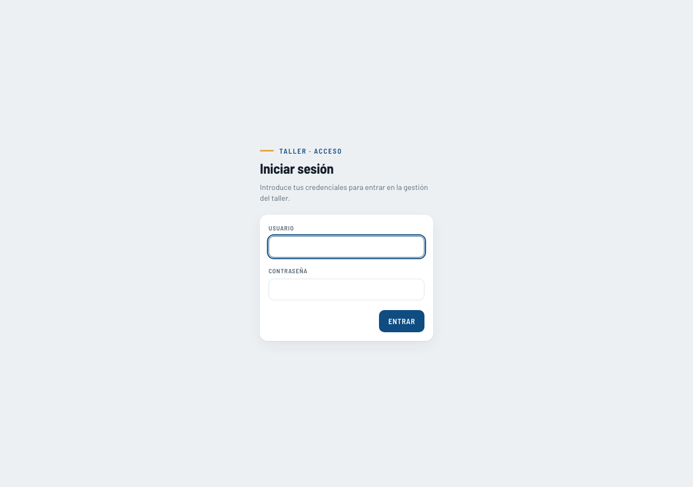
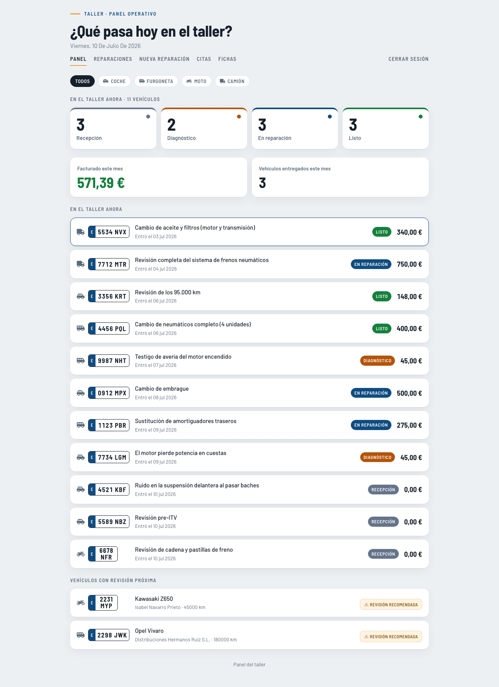
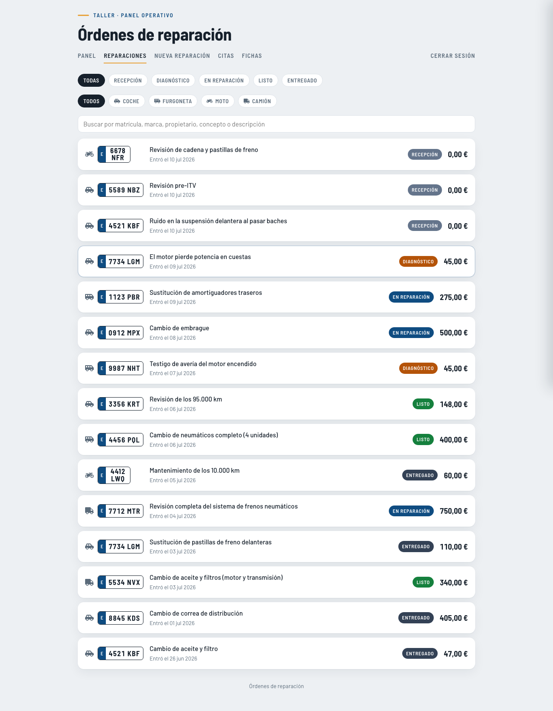
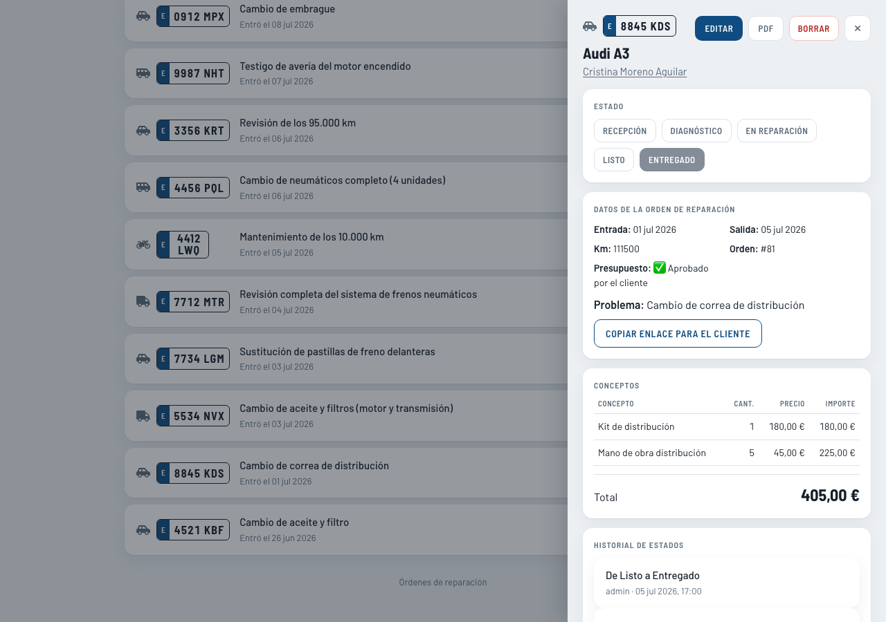
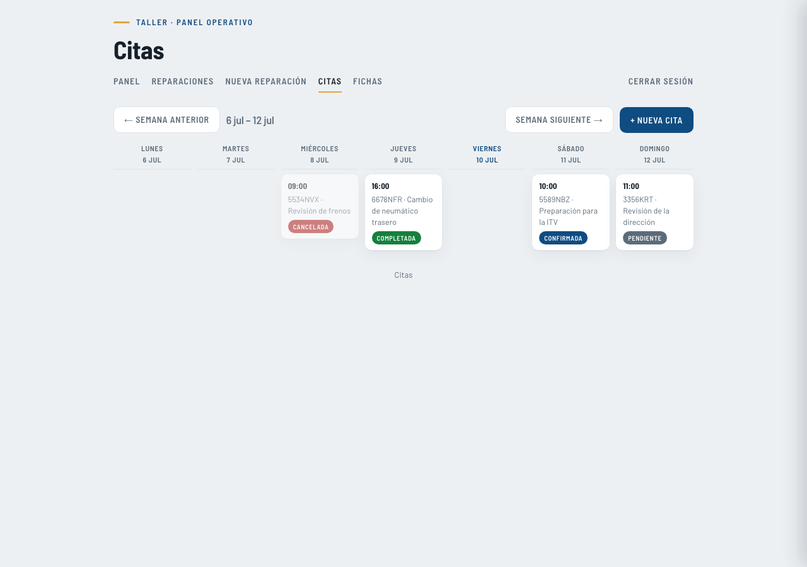
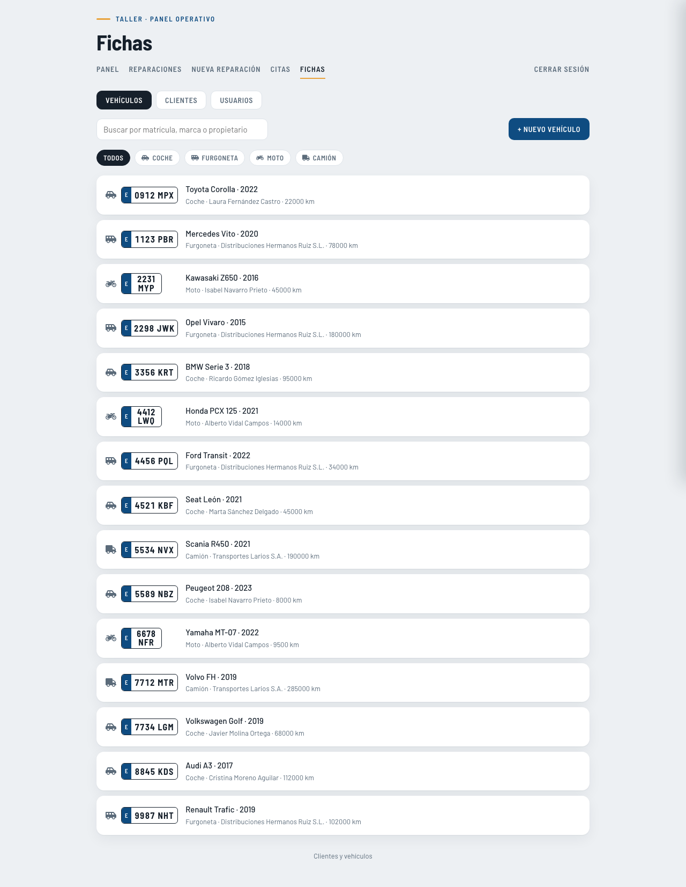
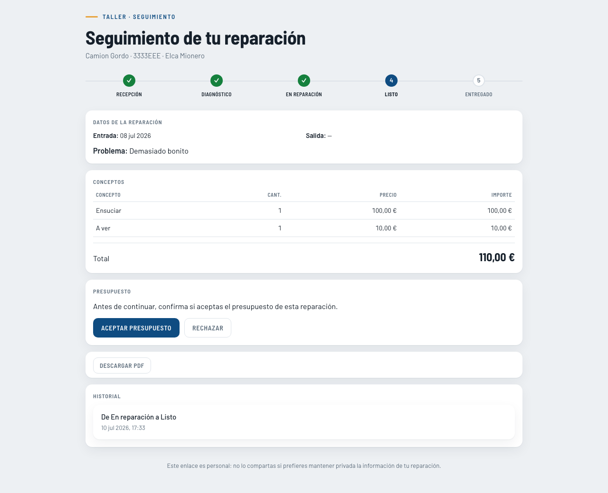

# Gestión de Taller

Aplicación web de gestión para un taller mecánico: clientes, vehículos, órdenes de reparación, presupuestos, citas y un portal de seguimiento público para el cliente final.

Proyecto de portfolio desarrollado como parte del ciclo de **2º DAM (Desarrollo de Aplicaciones Multiplataforma)**.

📄 **[Dossier de presentación](https://claude.ai/code/artifact/8529a545-f495-4b0c-875c-3d58670197eb)** — descripción funcional completa con capturas.

## Capturas

| | |
|---|---|
|  |  |
|  |  |
|  |  |

Portal de seguimiento público (sin login), accesible por enlace único desde cualquier orden:



## Funcionalidad

- **Clientes y vehículos**: fichas cruzadas (cliente ↔ flota de vehículos), navegación entre una y otra.
- **Órdenes de reparación**: flujo de estados (Recepción → Diagnóstico → En reparación → Listo → Entregado), líneas de mano de obra/piezas, generación de PDF, auditoría de cada cambio de estado (quién, cuándo, de qué estado a cuál).
- **Presupuestos**: el cliente aprueba o rechaza desde el portal público, sin necesidad de cuenta.
- **Citas**: vista semanal, alta de vehículo nuevo desde el propio formulario de cita, conversión de cita en orden de reparación manteniendo el vínculo entre ambas.
- **Aviso de revisión próxima**: cálculo automático por kilometraje y tipo de vehículo (coche/furgoneta/moto/camión, con intervalos distintos).
- **Portal de seguimiento público**: cada orden tiene un enlace único (UUID) para que el cliente vea el estado, el presupuesto y descargue el PDF sin iniciar sesión.
- **Roles**: admin (acceso total) y mecánico (todo excepto borrar registros y gestionar precios/usuarios).

## Stack técnico

- **Backend**: Java 21, Spring Boot 4.1.0 (Web MVC, Data JPA, Validation, Security), arquitectura en capas (model / repository / dto / service / controller).
- **Base de datos**: Oracle 21c (driver `ojdbc11`), Hibernate/JPA.
- **Autenticación**: sesión + Spring Security (formLogin, BCrypt, CSRF con cookie), roles admin/mecánico.
- **PDF**: OpenPDF.
- **Frontend**: HTML/CSS/JS sin frameworks, servido como estáticos desde el propio backend.

## Cómo arrancarlo en local

Requisitos: JDK 21, una instancia de Oracle accesible (por ejemplo Oracle XE en Docker) con un usuario/esquema ya creado.

1. Configura la conexión. Por defecto, la app apunta a `localhost:1521/XEPDB1` con usuario `taller`. Puedes sobrescribir cualquier valor con variables de entorno, sin tocar el código:

   ```bash
   export DB_URL="jdbc:oracle:thin:@localhost:1521/XEPDB1"
   export DB_USER="taller"
   export DB_PASSWORD="tu_password"
   export ADMIN_PASSWORD="una_password_fuerte"
   ```

2. Arranca la aplicación:

   ```bash
   ./mvnw spring-boot:run
   ```

3. Abre `http://localhost:8080/login.html`. En el primer arranque se crea automáticamente un usuario administrador (`admin` / la contraseña de `ADMIN_PASSWORD`, o `CambiaEstaClave123` si no se define).

## Estructura del proyecto

```
src/main/java/com/taller/gestion/
├── model/        # Entidades JPA (Cliente, Vehiculo, OrdenReparacion, LineaOrden, Servicio, Cita, Usuario, CambioEstado)
├── repository/    # Spring Data JPA
├── dto/          # Records de entrada/salida
├── service/      # Lógica de negocio
├── controller/   # REST API (/api/**)
└── security/     # Configuración de Spring Security, autenticación, roles

src/main/resources/
├── application.properties
└── static/       # Frontend (HTML/CSS/JS)
```
